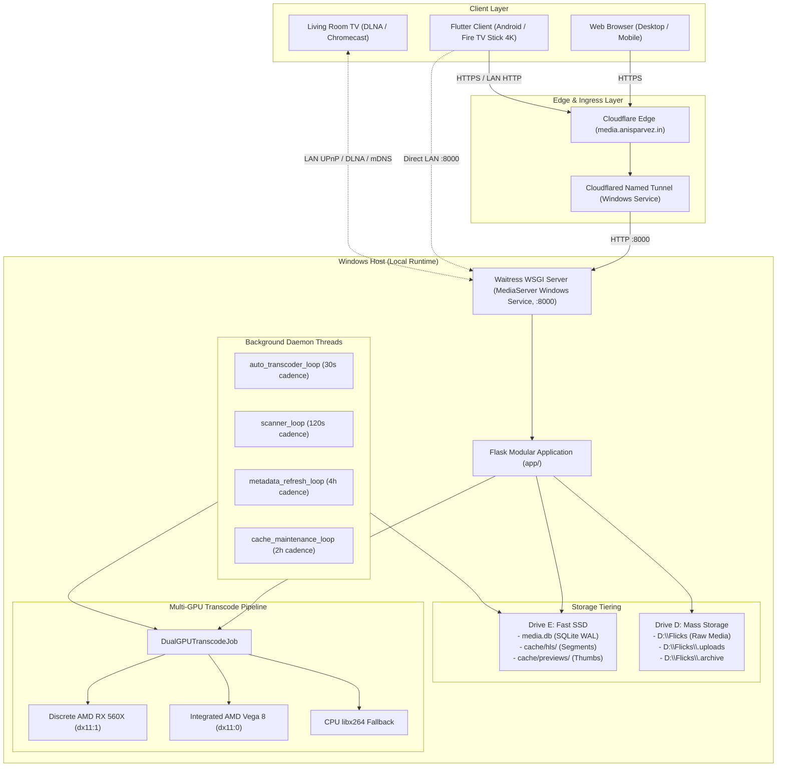
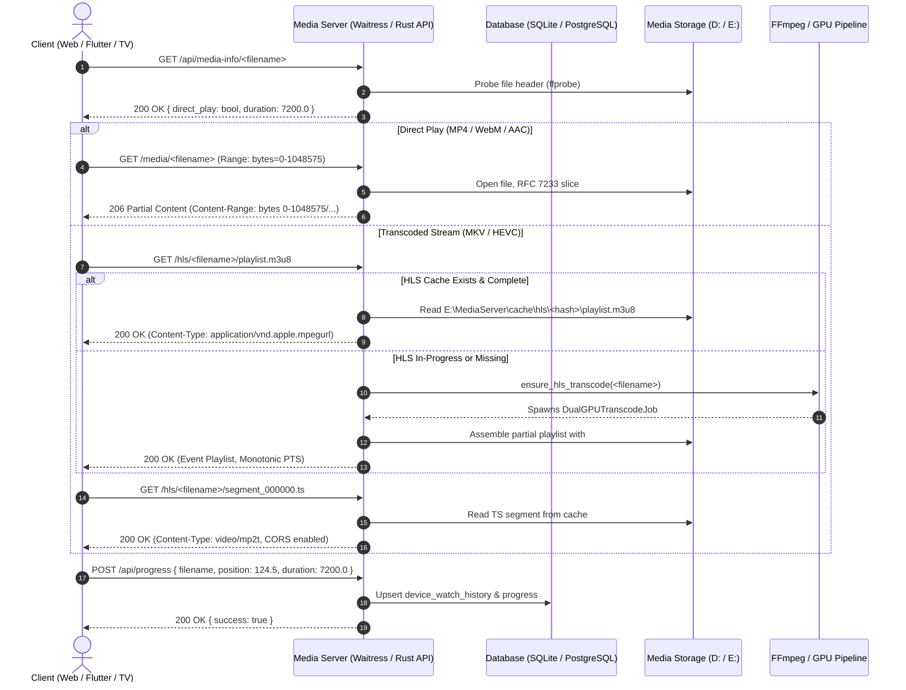
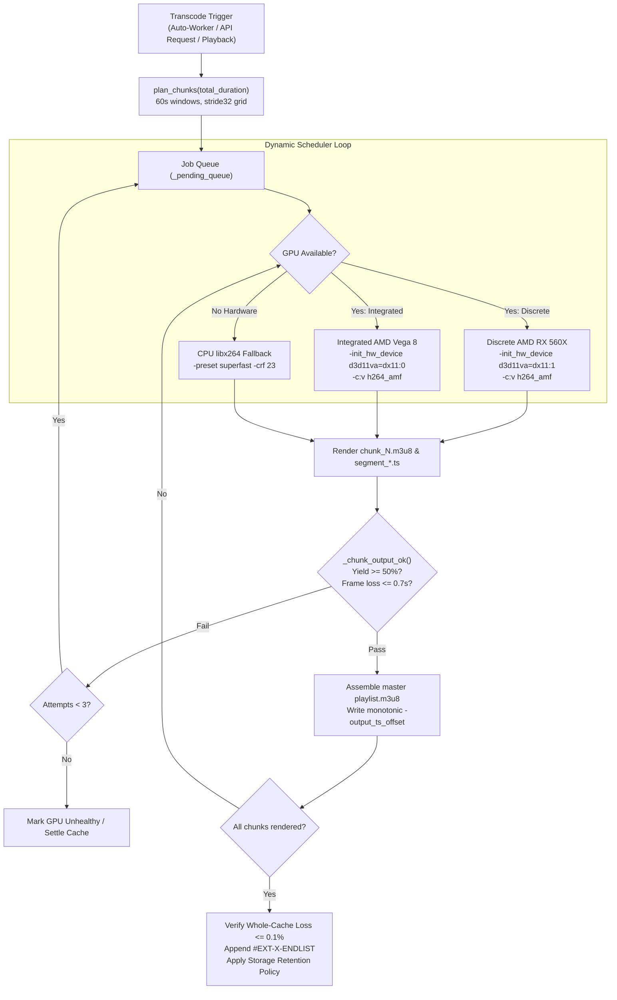

# Phase 0 Architecture Audit & Modernization Report
**Repository:** `anis7t/anis-home-media-server`  
**Working Branch:** `feat/rust-react-postgres-migration`  
**Starting Baseline Commit:** `9eea80b778b065669b3b96d2aa8a1dfd30423a35` ("docs: add Flask to Rust React PostgreSQL migration roadmap")  
**Date:** October 10, 2026  
**Auditor:** Antigravity (Google DeepMind)  
**Status:** Read-Only Audit Complete — Phase 0 Gate Established

---

## 1. Executive Summary & Working Environment Baseline

### 1.1 Git Working Baseline & Safety Verification
- **Integration Baseline:** Fast-forwarded local `main` to `origin/main` (`9eea80b`), integrating the official modernization roadmap (`docs/FLASK_RUST_REACT_POSTGRES_MIGRATION_ROADMAP.md`).
- **Feature Branch Created:** `feat/rust-react-postgres-migration` branched directly from `9eea80b`.
- **Preserved Uncommitted State:** The 12 pre-existing working-tree files were accounted for, preserved without alteration, and verified intact:
  - `GEMINI.md`: Direct ADB intent documentation.
  - `app/db.py`: SQLite connection timeout (`10.0s`), `PRAGMA busy_timeout=5000`, and `PRAGMA journal_mode=WAL`.
  - `app/routes/media.py`: Unused import cleanup.
  - `scripts/hls_frame_audit.py`: Legacy dense cache layout accounting.
  - `tests/test_storage_retention.py`: Test fixture isolation using temporary directory paths.
  - `flutter_client/` platform plugin registrants (CRLF/LF git checkout state).
  - `OPENCODE_CONFIG.md`: Untracked operational tooling guide.
- **Zero In-Tree Migration Work Detected:** Verified absence of existing `Cargo.toml`, `package.json`, `Dockerfile`, `*.rs`, `*.tsx`, or PostgreSQL configuration files. The repository remains purely Flask, SQLite, and Flutter.

---

## 2. Current-State Architecture & Process Topology

### 2.1 Hardware, Storage & Process Boundaries
The production system runs on a single host (Windows 11 with two AMD GPUs):
- **Drive Tiering:**
  - **Drive `E:` (Fast NVMe SSD):** Application code (`E:\MediaServer`), SQLite database (`E:\MediaServer\media.db`), live HLS chunks (`E:\MediaServer\cache\hls`), and seek hover thumbnails (`E:\MediaServer\cache\previews`).
  - **Drive `D:` (Mass Storage HDD):** Raw media library (`D:\Flicks`), resumable chunk upload staging (`D:\Flicks\.uploads`), cold video archives (`D:\Flicks\.archive`), and deleted-source staging (`D:\Flicks\.deleted`).
  - **Drive `C:`:** Reserved strictly for OS. No media server state.
- **Dual-GPU Acceleration:**
  - **Discrete GPU:** AMD Radeon RX 560X (D3D11 Adapter `1`, `d3d11va=dx11:1`, `h264_amf`).
  - **Integrated GPU:** AMD Radeon Vega 8 (D3D11 Adapter `0`, `d3d11va=dx11:0`, `h264_amf`).
  - **Software Fallback:** CPU encoding via `libx264` (`superfast` / `crf 23`).
- **Service Supervision:**
  - **`MediaServer` Windows Service:** Managed by NSSM (`bin\nssm.exe`), running Python WSGI via Waitress on `http://127.0.0.1:8000` with 8 worker threads (`run_production.py`). Survives system reboots without interactive login.
  - **`Cloudflared` Windows Service:** Named Cloudflare Tunnel routing public ingress from `https://media.anisparvez.in` to `http://127.0.0.1:8000`.



---

## 3. Flask Route and API Contract Inventory

The application exposes 42 endpoints registered across 6 blueprint layers (`pages`, `api`, `media`, `subtitles`, `cast`, and `upload` attached to `api`):

| Method(s) | Path | Blueprint / Handler | Consumer | Auth / Session | Description & Payloads |
|---|---|---|---|---|---|
| `GET` | `/` | `pages.home` | Web Browser | Cookie `ms_device_id` | Renders `templates/library.html`, optional `intro-overlay.html`. Query params: `q`, `sort`. |
| `GET` | `/movie/<path:filename>` | `pages.details` | Web Browser | Cookie `ms_device_id` | Renders `templates/details.html` with tech specs, TMDb extended details, and transcode status. |
| `GET` | `/watch/<path:filename>` | `pages.watch` | Web Browser | Cookie `ms_device_id` | Renders `templates/player.html` (single-script invariant, custom HTML5 controls). |
| `GET` | `/manage`, `/library` | `pages.manage` | Web Browser | Open | Renders storage governance, orphan audits, and manual library deletion interface. |
| `GET` | `/devices`, `/clients` | `pages.devices` | Web Browser | Cookie `ms_device_id` | Connected devices dashboard and telemetry list. |
| `GET` | `/manual`, `/help`, `/how-to-use` | `pages.manual` | Web Browser | Open | Static user guide and shortcuts cheatsheet. |
| `GET` | `/download` | `pages.download` | Web Browser | Open | Android APK installation page. |
| `GET` | `/manifest.webmanifest` | `pages.manifest` | Web Browser | Open | PWA manifest JSON. |
| `GET` | `/sw.js` | `pages.sw` | Web Browser | Open | Service worker caching script. |
| `GET` | `/icon.svg` | `pages.icon` | Web Browser | Open | Vector branding SVG icon. |
| `GET` | `/api/movies` | `api.api_movies` | Flutter, Web | `X-Device-Id` / Cookie | Returns JSON `{ movies: [...], watching: [...], total: N }` scoped per calling device. |
| `GET` | `/api/movie/<path:filename>` | `api.api_movie_details` | Flutter, Web | `X-Device-Id` / Cookie | Returns JSON `{ movie, specs, extended, backdrop_tmdb_id, transcode_info, needs_transcode, is_transcode_ready }`. |
| `GET` | `/api/media-info/<path:filename>` | `api.media_info` | Flutter, Web, Cast | Open | Probes video container, codecs, dimensions, and reports `direct_play` boolean. |
| `GET` | `/api/media-readiness/<path:filename>` | `api.media_readiness` | Flutter, Web | Open | Returns `{ direct_playable, needs_transcode, is_ready, is_running, status }`. |
| `GET, POST` | `/api/scan` | `api.api_scan` | Web, Flutter | Open | Triggers asynchronous scanner and missing transcode queue passes. |
| `DELETE, POST` | `/api/media/<path:filename>` | `api.api_delete_media` | Web | Open | Permanently unlinks media file, cascades SQLite row deletion, and purges transcode/preview caches. |
| `GET, POST` | `/api/progress` | `api.progress` | Flutter, Web | `X-Device-Id` / Cookie | `GET`: returns `{ position, duration }`. `POST`: upserts progress into `progress` and `device_watch_history`. |
| `GET` | `/api/transcode-status/<path:filename>` | `api.transcode_status` | Flutter, Web | Open | Returns transcode progress `{ status, bytes, percent, remaining, encoded, duration, speed }`. |
| `POST` | `/api/transcode/start/<path:filename>` | `api.start_media_transcode` | Flutter, Web | Open | Explicitly enqueues / kicks off background HLS transcode. |
| `GET` | `/api/transcodes` | `api.api_transcodes` | Web | Open | Returns array of all active background transcoding jobs. |
| `GET` | `/api/devices` | `api.api_devices` | Web | Open | Returns list of devices with GeoIP, user agents, active status, and watch history. |
| `GET, POST` | `/api/devices/heartbeat` | `api.api_devices_heartbeat` | Flutter, Web | `X-Device-Id` / Cookie | Updates device `last_seen` timestamp. Returns `{ success: true, device_id }`. |
| `POST` | `/api/devices/client-hints` | `api.api_devices_client_hints` | Flutter, Web | `X-Device-Id` / Cookie | Accepts `{ model, platform, platformVersion }` to decode Android OEM device hardware. |
| `POST` | `/api/devices/rename` | `api.api_devices_rename` | Web | Open | Renames device friendly display label. |
| `POST` | `/api/devices/delete` | `api.api_devices_delete` | Web | Open | Unlinks device record and removes cookie. |
| `GET` | `/api/system-status` | `api.api_system_status` | Flutter, Web | Open | Telemetry HUD: CPU, RAM, aggregated Storage Pool (D+E), and live GPU 0/1 utilization. |
| `GET` | `/api/storage/audit` | `api.storage_audit` | Web | Open | Scans HLS and preview caches against active media; reports orphaned directories and reclaimable bytes. |
| `POST` | `/api/storage/purge-orphans` | `api.storage_purge_orphans` | Web | Open | Safely deletes unreferenced transcode directories (supports `?dry_run=1`). |
| `GET, POST` | `/api/storage/settings` | `api.storage_settings` | Web | Open | Reads/updates retention policy (`keep`, `archive`, `purge_cache`, `delete_source`). |
| `POST` | `/api/storage/archive/<path:filename>` | `api.storage_archive_media` | Web | Open | Moves source file to `.archive` directory while preserving HLS playback cache. |
| `POST` | `/api/upload` | `api.upload` | Web | Open | Multipart/form-data single-shot video upload with atomic `.upload_*.part` staging. |
| `POST` | `/api/upload/chunk/init` | `api.chunk_upload_init` | Web | Open | Initializes chunked resumable upload session (20 GiB max limit). Returns `upload_id`. |
| `GET, POST, DELETE` | `/api/upload/chunk/<upload_id>` | `api.chunk_upload` | Web | Open | Query offset, upload 8MB slice at `X-Upload-Offset`, or abort upload session. |
| `POST` | `/api/upload/chunk/<upload_id>/complete` | `api.chunk_upload_complete` | Web | Open | Validates byte integrity, moves file to target, triggers TMDb scan and pre-transcoding. |
| `POST` | `/api/upload-subtitle/<path:filename>` | `api.api_upload_subtitle` | Web | Open | Receives `.srt`/`.vtt`, auto-detects language via Unicode/NLP, saves next to media. |
| `GET` | `/api/subtitles/<path:filename>` | `subtitles.api_subtitles` | Flutter, Web | Open | Returns JSON list of available subtitle tracks. |
| `GET` | `/subtitles/<path:filename>/<name>` | `subtitles.subtitle` | Flutter, Web | Open | Streams sidecar subtitle converted on-the-fly to WebVTT. |
| `GET` | `/subtitles/embedded/<path:filename>/<int:idx>.vtt` | `subtitles.subtitle_embedded` | Flutter, Web | Open | Extracts embedded subtitle stream via FFmpeg and serves as WebVTT. |
| `GET` | `/subtitles/online/<path:filename>.vtt` | `subtitles.subtitle_online` | Flutter, Web | Open | Downloads and serves OpenSubtitles match. |
| `GET` | `/media/<path:filename>` | `media.media` | Flutter, Web, Cast | Open | Zero-copy RFC 7233 byte-range delivery with DLNA headers and CORS support. |
| `GET` | `/hls/<path:filename>/playlist.m3u8` | `media.hls_playlist` | Flutter, Web, Cast | Open | Dynamic master HLS playlist assembly with PTS alignment and event window tags. |
| `GET` | `/hls/<path:filename>/<segment>` | `media.hls_segment` | Flutter, Web, Cast | Open | Serves individual HLS transport stream (`.ts`) video segments. |
| `GET` | `/api/seek-preview-meta/<path:filename>` | `media.seek_preview_meta` | Flutter, Web | Open | Probes video duration and returns seek hover thumbnail intervals and dimensions. |
| `GET` | `/seek-preview/<path:filename>/<thumb>` | `media.seek_preview_thumbnail` | Flutter, Web | Open | On-demand frame extraction via FFmpeg with JPEG disk caching (`cache/previews/`). |
| `GET` | `/poster/<path:filename>` | `api.poster` | Flutter, Web | Open | Serves local poster artwork file. |
| `GET` | `/tmdb-poster/<int:tmdb_id>` | `api.tmdb_poster` | Flutter, Web | Open | Serves cached TMDb poster image, downloading on-demand if missing. |
| `GET` | `/tmdb-backdrop/<int:tmdb_id>` | `api.tmdb_backdrop` | Flutter, Web | Open | Serves cached TMDb backdrop image, downloading on-demand if missing. |
| `GET` | `/api/cast/devices` | `cast.cast_devices` | Flutter, Web | Open | Returns discovered DLNA UPnP renderers and mDNS Chromecasts on the local network. |
| `POST` | `/api/cast/play` | `cast.cast_play` | Flutter, Web | Open | Instructs remote TV receiver to load media URL. |
| `POST` | `/api/cast/control` | `cast.cast_control` | Flutter, Web | Open | Controls playback (`play`, `pause`, `stop`, `seek`, `volume`). |
| `GET` | `/api/cast/status` | `cast.cast_status` | Flutter, Web | Open | Queries current state of the active casting session. |
| `GET` | `/api/app/update` | `api.api_app_update` | Flutter | Open | Checks in-app update manifest (`production` or `developer` channel). |
| `GET` | `/api/app/download` | `api.api_app_download` | Flutter, Web | Open | Streams signed Android APK binary with resume/range download support. |

---

## 4. Current Frontend Page Inventory & Proposed React Migration Map

### 4.1 Page Inventory & Current State
The current web interface relies on server-rendered Jinja2 templates styled with custom CSS (`static/css/main.css`, 110 KB), vanilla JavaScript (`static/js/`), and `hls.min.js`:

1. **`templates/library.html` (Home / Catalog):**
   - Renders movie card grid, "Continue Watching" rail, search bar, sort options, and live System Telemetry HUD.
   - Includes `templates/intro-overlay.html` (3.0-second Web Audio brand intro sting).
   - Driven by `static/js/library.js` and `static/js/nav.js`.
2. **`templates/details.html` (Movie Details):**
   - High-resolution hero backdrop, poster art, technical specifications pills (codec, bitrate, channels, aspect ratio), cast avatar rail, synopsis, and subtitle upload modal.
   - Action buttons: "Play Now", "Resume", "Upload Subtitle", "Archive Source", and "Delete".
   - Driven by `static/js/details.js`.
3. **`templates/player.html` (Web Cinema Player):**
   - Strict single-`<script>` invariant.
   - Custom SVG controls overlay: Equidistant seekbar (`static/js/seekbar-youtube.js`), seek hover frame previews (`/api/seek-preview-meta/`), dual-axis WebVTT subtitle styling and vertical positioning, audio track selector, speed picker, casting modal (DLNA / Chromecast), and Stats for Nerds telemetry HUD.
4. **`templates/manage.html` (Library & Storage Management):**
   - Storage Pool telemetry breakdown (D: and E: drive utilization), post-transcode retention policy selector, orphaned cache reconciliation table, and one-click cache purge button.
5. **`templates/devices.html` (Connected Devices Dashboard):**
   - Tabbed device catalog (Active Now vs Offline), GeoIP / ISP location tags, browser / OS icons, device renaming modal, and per-device watch history lists.
6. **`templates/manual.html` (Interactive User Guide):**
   - Full keyboard shortcuts cheatsheet, touch gestures, multi-GPU streaming explanation, and casting instructions.
7. **`templates/download.html` (Android App Distribution):**
   - Responsive download card displaying production APK version, file size, SHA-256 fingerprint, and direct download CTA.

### 4.2 Proposed React Component Migration Hierarchy
Proposed directory structure under `web/src/` utilizing Vite, TypeScript, Tailwind CSS, and TanStack Query:

```text
web/src/
├── app/
│   ├── App.tsx                   # Main router outlet and provider setup
│   └── routes.tsx                # React Router v6 route definitions matching legacy URLs
├── components/
│   ├── brand/
│   │   ├── BrandHeader.tsx       # Frosted obsidian header, SVG play logo, nav actions
│   │   ├── BrandIntroOverlay.tsx # 3.0s canvas render loop & Web Audio sting
│   │   └── BrandFooter.tsx       # Standard footer with version & manual links
│   ├── layout/
│   │   ├── AppShell.tsx          # Responsive navigation wrapper & device tracking
│   │   └── Modal.tsx             # Accessible dialogs with focus trapping
│   └── ui/                       # Tailwind / shadcn base atoms (Button, Badge, Slider, Select)
├── features/
│   ├── library/
│   │   ├── components/
│   │   │   ├── MovieGrid.tsx     # Responsive poster grid with virtualized rendering
│   │   │   ├── MovieCard.tsx     # Poster art, progress bar, title, year
│   │   │   ├── ContinueWatchingRail.tsx # 140px desktop / 115px mobile cards
│   │   │   └── SearchBar.tsx     # Debounced library search & filter
│   │   └── pages/HomePage.tsx
│   ├── details/
│   │   ├── components/
│   │   │   ├── HeroBackdrop.tsx  # Dynamic backdrop with dark obsidian gradient fade
│   │   │   ├── TechnicalSpecs.tsx# Audio/video codec, resolution, and audio channels
│   │   │   ├── CastRail.tsx      # Horizontally scrollable cast avatar list
│   │   │   └── SubtitleUploadDialog.tsx # NLP language auto-detect subtitle uploader
│   │   └── pages/DetailsPage.tsx
│   ├── player/
│   │   ├── components/
│   │   │   ├── VideoSurface.tsx  # Clamped viewport video element (hls.js / direct)
│   │   │   ├── ControlsOverlay.tsx # Auto-hiding gradient controls bar
│   │   │   ├── Seekbar.tsx       # Equidistant timeline with hover thumbnail preview
│   │   │   ├── SubtitleSettingsModal.tsx # Dual-axis cue position & font styling
│   │   │   ├── CastModal.tsx     # Remote DLNA / Chromecast discovery & transport
│   │   │   └── NerdStatsHud.tsx  # Frame drops, forward buffer, and transcode telemetry
│   │   └── pages/PlayerPage.tsx
│   ├── management/
│   │   ├── components/
│   │   │   ├── StoragePoolCard.tsx # Aggregated D: and E: drive metrics
│   │   │   ├── RetentionPolicyForm.tsx # Radio selector for keep/archive/purge
│   │   │   └── OrphanPurgeTable.tsx # Stale transcode auditor and purge trigger
│   │   └── pages/ManagePage.tsx
│   ├── devices/
│   │   ├── components/
│   │   │   ├── DeviceCard.tsx    # Hardware make/model, GeoIP, active status pill
│   │   │   └── WatchHistoryList.tsx # Device-scoped resume timestamps
│   │   └── pages/DevicesPage.tsx
│   └── manual/
│       └── pages/ManualPage.tsx
└── lib/
    ├── api/                      # Strongly-typed Axios / Fetch client matching backend contracts
    ├── hooks/
    │   ├── useDevicePresence.ts  # Automatic 40s heartbeat & High-Entropy Client Hints
    │   ├── useTranscodeStatus.ts # 1s status polling for in-flight transcodes
    │   └── useWatchProgress.ts   # Throttled watch progress reporter
    └── types/                    # TypeScript interfaces for Movie, Device, Specs, Transcode
```

---

## 5. Database Schema Inventory & PostgreSQL Migration Strategy

### 5.1 SQLite Current Schema (`media.db`)
The current database is managed via SQLite in `app/db.py`:

```sql
-- Schema version tracking
CREATE TABLE schema_migrations (
    version INTEGER PRIMARY KEY
);

-- Global movie playback progress (legacy fallback)
CREATE TABLE progress (
    filename TEXT PRIMARY KEY,
    position REAL NOT NULL DEFAULT 0,
    duration REAL NOT NULL DEFAULT 0,
    updated_at DATETIME DEFAULT CURRENT_TIMESTAMP
);

-- Library catalog and TMDb metadata
CREATE TABLE movies (
    filename TEXT PRIMARY KEY,
    title TEXT,
    year INTEGER,
    tmdb_id INTEGER,
    overview TEXT,
    poster_path TEXT,
    backdrop_path TEXT,
    runtime INTEGER,
    genres TEXT,
    vote_average REAL,
    updated_at INTEGER,
    release_date TEXT,
    added_at INTEGER,
    details_json TEXT,           -- Serialized JSON object (cast, director, tagline, certifications)
    last_metadata_refresh INTEGER -- Epoch timestamp of last 4-hour TMDb refresh
);

-- Connected client devices
CREATE TABLE devices (
    device_id TEXT PRIMARY KEY,
    custom_name TEXT,
    device_name TEXT,
    device_type TEXT,
    device_os TEXT,
    browser TEXT,
    user_agent TEXT,
    connection_type TEXT,
    client_ip TEXT,
    public_ip TEXT,
    mac_address TEXT,
    isp TEXT,
    city TEXT,
    country TEXT,
    first_seen DATETIME DEFAULT CURRENT_TIMESTAMP,
    last_seen DATETIME DEFAULT CURRENT_TIMESTAMP,
    device_model TEXT
);

-- Per-device watch history and resume points
CREATE TABLE device_watch_history (
    id INTEGER PRIMARY KEY AUTOINCREMENT,
    device_id TEXT NOT NULL,
    filename TEXT NOT NULL,
    position REAL NOT NULL DEFAULT 0,
    duration REAL NOT NULL DEFAULT 0,
    completed INTEGER NOT NULL DEFAULT 0,
    last_watched DATETIME DEFAULT CURRENT_TIMESTAMP,
    UNIQUE(device_id, filename)
);

-- External IP GeoIP and ISP cache
CREATE TABLE ip_cache (
    ip TEXT PRIMARY KEY,
    isp TEXT,
    org TEXT,
    city TEXT,
    country TEXT,
    updated_at DATETIME DEFAULT CURRENT_TIMESTAMP
);

-- Application configuration key-value store
CREATE TABLE settings (
    key TEXT PRIMARY KEY,
    value TEXT NOT NULL,
    updated_at DATETIME DEFAULT CURRENT_TIMESTAMP
);

-- Indexes
CREATE INDEX idx_devices_last_seen ON devices(last_seen DESC);
CREATE INDEX idx_dwh_device ON device_watch_history(device_id, last_watched DESC);
CREATE INDEX idx_progress_updated ON progress(updated_at DESC);
```

### 5.2 PostgreSQL Target Schema & Migration Strategy
1. **Type Conversions:**
   - SQLite `TEXT` JSON fields (`details_json`) converted to native PostgreSQL `JSONB` for structured querying and GIN indexing.
   - SQLite `DATETIME` strings converted to `TIMESTAMPTZ`.
   - SQLite `INTEGER` epoch timestamps (`added_at`, `updated_at`, `last_metadata_refresh`) converted to `TIMESTAMPTZ` with `to_timestamp()` during extraction.
   - SQLite `INTEGER PRIMARY KEY AUTOINCREMENT` on `device_watch_history` converted to `BIGINT GENERATED ALWAYS AS IDENTITY`.
2. **Referential Integrity:**
   - Establish explicit Foreign Key constraints:
     `device_watch_history.device_id` REFERENCES `devices(device_id) ON DELETE CASCADE`
     `device_watch_history.filename` REFERENCES `movies(filename) ON DELETE CASCADE`
3. **Rust SQLx Schema Migration Definition:**
   Versioned migrations in `backend/migrations/` managed with `sqlx migrate`.
4. **Data Transfer & Verification Utility:**
   - Create a dedicated CLI command (`migrate-sqlite-to-postgres`) in Rust.
   - Stream rows from SQLite snapshot `E:\MediaServer\.opencode\db\media.snapshot.db` (or direct read lock on `media.db` with `PRAGMA busy_timeout=10000`).
   - Validate row counts, primary key uniqueness, foreign key validity, and JSONB parse integrity before cutover.

---

## 6. Flutter Client API Compatibility Matrix

The Flutter application (`flutter_client/`, package `in.anisparvez.media_server_client`) runs as a single universal APK across Android mobile phones and Amazon Fire TV Stick 4K (`AFTMM`). It strictly expects the following contracts:

| Flutter Feature / Service | Endpoints Called | Headers & Parameters Sent | Expected Response Structure | Breaking Risks & Migration Invariants |
|---|---|---|---|---|
| **Device Presence & Telemetry** (`DevicePresenceController`) | `POST /api/devices/heartbeat`, `POST /api/devices/client-hints` | `X-Device-Id: dev_<hash>`, User-Agent carries `Mobile` or `TV` signature | `{ success: true, device_id: "dev_..." }` | Must preserve device identity format. Heartbeat failures must be non-fatal. |
| **Library Browsing** (`MovieRepository`) | `GET /api/movies` | `X-Device-Id` | `{ movies: [...], watching: [...], total: N }` | Scoped by `X-Device-Id`. Year must be integer or null; rating must be float or null. |
| **Movie Details** (`MovieDetailsController`) | `GET /api/movie/<filename>` | `X-Device-Id` | `{ movie: {...}, specs: {...}, extended: {...}, is_transcode_ready: bool }` | Autofocus button on Fire TV relies on `is_transcode_ready` and `movie.position`. |
| **Playback Mode Handshake** (`PlayerMediaResolver`) | `GET /api/media-info/<filename>` | Standard GET | `{ direct_play: bool, duration: float, video_codec: str }` | **Authoritative flag:** If `direct_play == true`, client plays `/media/<filename>`; if `false`, plays `/hls/<filename>/playlist.m3u8`. |
| **Live Seek Preview** (`SeekPreviewController`) | `GET /api/seek-preview-meta/<filename>`, `GET /seek-preview/<filename>/thumb_<idx>.jpg` | Standard GET | `{ duration, interval: 5.0, count, width: 160, height: 90 }` | Must return exact image dimensions and valid 5-second interval frames. Debounced at 100ms on D-pad scrub. |
| **Sidecar Subtitles** (`PlayerMediaResolver`) | `GET /api/subtitles/<filename>`, `GET /subtitles/<filename>/<name>` | Standard GET | `{ tracks: [ { id, title, language, src, is_default } ] }` | Tracks served as standard WebVTT (`text/vtt`) with CORS headers. |
| **Watch Progress Reporting** (`PlaybackProgressReporter`) | `POST /api/progress` | Body: `{ filename, position, duration }`, `X-Device-Id` | `{ success: true }` | Throttled (every 10s and on player exit). Must update `device_watch_history`. |
| **In-App Updater** (`UpdateService`) | `GET /api/app/update?channel=production` | Standard GET | `{ latestVersion, latestVersionCode, minSupportedVersionCode, downloadUrl }` | Enforces `minSupportedVersionCode`. Download URL points to `/api/app/download`. |

---

## 7. End-to-End Media Streaming & Playback Data Flow



---

## 8. End-to-End Transcoding Data Flow & Dual-GPU Scheduling

### 8.1 Transcoding Lifecycle & Strided Grid Invariants
Transcoding is coordinated by `app/services/chunk_transcode_service.py` and `app/services/gpu_service.py`:
1. **Keyframe-Aware Chunks:** Total video runtime is split into 60-second chunks (`DEFAULT_CHUNK_DURATION = 60.0s`).
2. **Strided Segment Grid (`stride32`):**
   - Each chunk $N$ writes segments starting at index $N \times 32$ (`start_seg = chunk_id * 32`).
   - Prevents race conditions and boundary collisions where chunk $N$ overwrites segment $0$ of chunk $N+1$.
3. **Dual-GPU Allocation:**
   - Worker 0: Discrete AMD Radeon RX 560X (`d3d11va=dx11:1`, priority weight 1).
   - Worker 1: Integrated AMD Radeon Vega 8 (`d3d11va=dx11:0`, priority weight 2).
   - Chunks are scheduled dynamically from a shared queue (`_pending_queue`) under `_state_lock`.
4. **Frame-Exact Boundary Tolerance:**
   - Tolerates fixed 0.7s keyframe alignment slack in integer frames (`chunk_boundary_frame_tolerance(fps)`).
   - Whole-cache ceiling: Maximum allowed loss across the entire movie is $\max(10\text{s}, 0.1\% \times \text{runtime})$.
5. **Master Playlist Assembly:**
   - Worker parses actual `#EXTINF:<dur>` durations from individual chunk playlists.
   - Master playlist is rewritten under `_PLAYLIST_WRITE_LOCK`.
   - In-flight streams include `#EXT-X-PLAYLIST-TYPE:EVENT` and `#EXT-X-START:TIME-OFFSET=0`.
   - Sealed with `#EXT-X-ENDLIST` only after verifying full video coverage ($\ge 98\%$).



---

## 9. Security, Deployment, Observability & Rollback Considerations

1. **Authentication & Access Control (Critical Current Gap):**
   - Currently, the application has **no user authentication or password barrier**. Anyone reaching `media.anisparvez.in` can browse, stream, delete files, and trigger transcodes.
   - Cloudflare Named Tunnel provides HTTPS and DNS, but does not enforce authentication.
   - **Modernization Requirement:** Introduce secure JWT / session authentication in Rust with Argon2 password hashing before opening wider public access.
2. **Filesystem Traversal Protection:**
   - Enforce `safe_path(filename)` across all roots (`config.get_media_roots()`). Absolute paths and relative traversals (`../`) must be strictly rejected (returning HTTP 403/404).
3. **Process Supervision & Crash Recovery:**
   - On Windows, the Rust backend must integrate with NSSM or run as a native Windows Service (`windows-service` crate) alongside Cloudflared.
   - On Linux, systemd service units with auto-restart (`Restart=always`).
4. **Backup & Rollback Procedures:**
   - Automated nightly SQLite snapshotting via PowerShell / cron (`E:\MediaServer\.opencode\db\refresh-snapshot.ps1`).
   - In Phase 3 (PostgreSQL), execute `pg_dump` prior to any schema change and test rollback restoration scripts.

---

## 10. Existing Test Coverage & Important Gaps

### 10.1 Existing Suite Baseline
- **Python / Pytest Suite:**
  - 365 tests collected across `tests/` (100% passing baseline verified: `361 passed, 1 skipped`).
  - Unit tests for formatting, subtitles, range parsing, resolvers, and device tracking.
  - Integration tests for caching, multi-root storage, DLNA headers, CORS, and frame accounting.
  - Selenium E2E tests for player multi-seek and playback advancement (`test_selenium_seek_playback.py`).
- **Flutter Test Suite:**
  - 57 test files, 261 passed, 12 skipped (gated live-server tests).
  - 100% coverage for 2D spatial focus traversal, TV Back key navigation, coordinated overlay states, and playback mode indicators.

### 10.2 Critical Test Gaps
1. **Contract Tests:** No OpenAPI spec or formal contract test harness currently exists between Flask and clients.
2. **Hardware Acceleration in CI:** AMF dual-GPU transcoding requires physical AMD hardware on Windows (`dx11:0` and `dx11:1`); cannot run on standard headless Linux GitHub Actions runners.
3. **Concurrency & Load Tests:** Only historical load scripts in `tests/load/`; lack automated benchmarking for concurrent HTTP range requests across Cloudflare tunnels.

---

## 11. Severity-Ranked Risk Register

| Risk ID | Severity | Description | Impact | Mitigation Strategy |
|---|---|---|---|---|
| **R-01** | **Critical** | Dual-Scheduler Split-Brain Race | Both Flask and Rust workers attempting to transcode the same movie simultaneously, causing segment file corruption. | **Single Queue Owner Invariant:** The transcoder worker stays exclusively in Python until Phase 6; Rust only triggers it via existing API endpoints until complete cutover. |
| **R-02** | **Critical** | Data Loss During SQLite to Postgres Migration | Watch history, custom device names, or metadata lost during database migration. | Idempotent transfer script, pre-migration snapshot, row-count reconciliation, and dual-run read verification. |
| **R-03** | **High** | Flutter Client Playback Regression | Breaking changes in `/api/movies`, `/api/media-info`, or `/hls/` breaking Fire TV / Android playback. | Freeze API contracts with contract tests; do not alter JSON field types (`int` years, `float` ratings). |
| **R-04** | **High** | Dual-GPU AMF Transcode Regressions on Windows | Rust worker generating incompatible FFmpeg arguments for AMD D3D11va AMF encoders (`dx11:0` / `dx11:1`). | Preserve exact FFmpeg argument templates (`-init_hw_device d3d11va=dx11:N`, `-c:v h264_amf`) and test on physical host. |
| **R-05** | **High** | Cloudflare Tunnel & RFC 7233 Range Incompatibilities | Video seeking freezing due to missing HTTP 206 headers or chunk streaming buffering stalls. | Implement zero-copy byte streaming in Axum (`tower-http` / `tokio::fs`) with explicit `Range`, `Content-Range`, and `Accept-Ranges` checks. |
| **R-06** | **Medium** | Stale Edge Caching of Live Playlists | Cloudflare CDN caching dynamic `.m3u8` playlists while transcoding is in flight. | Replicate exact edge cache headers: `CDN-Cache-Control: no-store` on `.m3u8` and dynamic API paths. |
| **R-07** | **Medium** | Windows Process Signal Broadcasting (`os.kill`) | Sending termination signals broadcasting `CTRL_C_EVENT` to console groups, killing IDE or agent processes. | Use Win32 `OpenProcess` and `TerminateProcess` or safe Tokio process management without console broadcasting. |

---

## 12. Implementation Sequence & Estimated Effort Ranges

| Phase | Description | Pre-requisites | Rough Estimate |
|---|---|---|---|
| **Phase 0** | **Read-Only Architecture Audit & Safe Branch Setup** | None | **Complete** |
| **Phase 1** | **API Contracts, OpenAPI Specification & Reusable Contract Tests** | Phase 0 | 1–2 weeks |
| **Phase 2** | **React Web Frontend (Vite + TS + Tailwind + TanStack Query)** | Phase 1 | 2–4 weeks |
| **Phase 3** | **PostgreSQL Schema Definition & Idempotent Migration Tool** | Phase 0, 1 | 1–3 weeks |
| **Phase 4** | **Rust Backend Foundation (Axum + Tokio + SQLx + Health/Auth)** | Phase 1, 3 | 2–4 weeks |
| **Phase 5** | **Rust Streaming, Media Discovery & Subtitle Delivery** | Phase 2, 4 | 3–5 weeks |
| **Phase 6** | **Rust Transcoding Worker & Dual-GPU Scheduling Orchestration** | Phase 4, 5 | 3–6 weeks |
| **Phase 7** | **Final Traffic Cutover, Hardening, and Flask Retirement** | All phases | 2–3 weeks |
| **Total** | | | **14–27 weeks** |

---

## 13. Recommended Smallest Safe First Implementation Task

### Task: Phase 1 — OpenAPI 3.1 Specification & Reusable API Contract Test Suite

#### 13.1 Objective & Scope
Establish the authoritative, machine-readable API contract specification (`docs/openapi.yaml` or `api/openapi.json`) and a dedicated test suite verifying every existing Flask endpoint response schema, status code, and header contract against the specification.

#### 13.2 What This Task Touches
- **Added Files:**
  - `docs/openapi.yaml`: Complete OpenAPI 3.1 schema covering all 42 endpoints.
  - `tests/test_api_contracts.py`: Automated contract validator using `openapi-core` or `jsonschema` ensuring current Flask responses strictly adhere to the specification.
- **Zero Production Changes:**
  - No changes to Flask production logic.
  - No database changes.
  - No deployment changes.
  - 100% backward-compatible and safe to merge to `feat/rust-react-postgres-migration`.

#### 13.3 Acceptance Criteria
1. OpenAPI specification validates cleanly with standard linters.
2. `test_api_contracts.py` passes 100% against all core endpoints (`/api/movies`, `/api/movie/<filename>`, `/api/media-info/<filename>`, `/api/progress`, `/api/system-status`, `/api/devices`, `/api/app/update`).
3. Verifies that all field types match Flutter client expectations (`year` as nullable integer, `rating` as nullable float, `position` and `duration` as floats).
4. Forms the concrete verification baseline required before Phase 2 (React client) and Phase 4 (Rust API).
