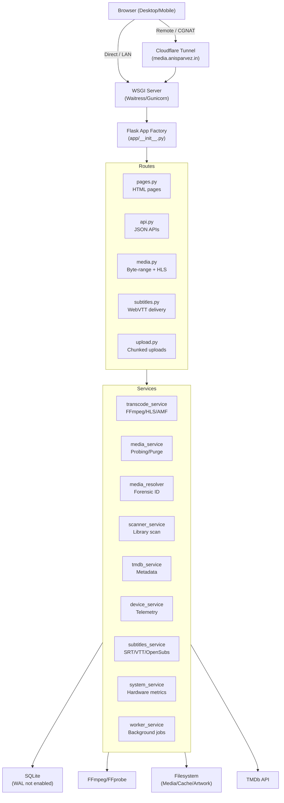

# Kali Linux Media Server — Complete Repository Assessment & Roadmap

## 1. Executive Summary

This is a **functional, development-stage personal media server** built with Flask, supporting direct MP4 byte-range streaming and on-demand HLS transcoding for MKV/HEVC. The application is well-architected with a modular `app/` package, comprehensive test suite (106 tests), and thorough documentation.

**Current branch:** `fix/windows-purge-reliability` (diverged from remote by 1 commit)
**Previous environment:** Kali Linux | **Current environment:** Windows 11
**Python:** 3.14.3 | **FFmpeg:** 9.0.1 with AMF support

### Critical Findings

| Finding | Impact | Status |
|---|---|---|
| AMF D3D11 adapter binding is **implemented** (`dx11:1` + `dx11:0`) | Multi-GPU selection works in code | ✅ Implemented & Verified in Runtime |
| `.seek-preview` and live frame preview | Seek frame hover preview | ✅ Implemented via `preview_service.py` |
| Hold-to-speed-up gesture | In-player speed control | ✅ Removed from events & shortcuts modal |
| `v.currentTime` committed on release | Range-request flood prevention | ✅ Fixed (committed on pointerup/touchend) |
| `run_production.py` entry point | Production WSGI hosting | ✅ Created & operational via NSSM service |
| Windows persistent automatic services | Headless boot & crash recovery | ✅ Implemented via NSSM & Cloudflared |
| Upload lifecycle & dynamic processing card | Upload UX & background indexing status | ✅ Implemented & hardened |
| `manage.html` inline Jinja in `onclick` | Potential JS syntax break on special chars | 🔶 Hardened with data attributes |
| SQLite default timeout & WAL mode | Can cause "database is locked" under load | 🔶 Reliability backlog |


---

## 2. Project History / Existing Agent Context

### Agent Context Files

| File | Size | Purpose | Still Accurate? |
|---|---|---|---|
| [`AGENTS.md`](file:///c:/MediaServer/AGENTS.md) | 13.6 KB | Comprehensive agent instructions, invariants, priorities | ✅ Mostly accurate; see discrepancies below |
| [`GEMINI.md`](file:///c:/MediaServer/GEMINI.md) | 16.2 KB | Detailed technical invariants and implementation rules | ✅ Accurate but contains Linux-specific testing instructions |

### Key Discrepancies Found

1. **GEMINI.md §2 references Linux-only paths** (`/usr/bin/geckodriver`, `/usr/bin/firefox`, `/home/iamroot/media-server-1/app.py`). These are historical from the Kali development phase and do not apply on Windows.

2. **AGENTS.md §4.10 references "RTX 560X"** — this is an NVIDIA brand name. The actual GPU is **AMD Radeon RX 560X**. The same typo appears in `MULTI_GPU_CHUNKED_TRANSCODING_PROPOSAL.md`.

3. **AGENTS.md §4.9 describes Issue #7** (purge SIGKILL on Windows) as high priority, but `PROJECT_STATUS.md` omits it entirely from the known bugs list.

4. **AGENTS.md §13 immediate priorities** reference the `gpu-amf-transcoding` branch, but current branch is `fix/windows-purge-reliability` which includes the AMF fix already.

5. **Hold-to-speed-up** is documented as "parked" (should not be present), but the Player Frontend analysis confirms it **is still active** in `player.html`.

---

## 3. Repository Structure

```text
c:\MediaServer\
├── app.py                 # 5.7 KB — Lightweight entry point + compatibility exports
├── requirements.txt       # 330 B — Flask, requests, dotenv, waitress, gunicorn (non-Win)
├── gunicorn.conf.py       # 1.8 KB — Linux Gunicorn config (1 worker, 8 threads)
├── scanner.py             # 14 KB — Root-level library scanner with TMDb integration
├── posters.py             # 3.3 KB — Root-level poster download utility
├── server.sh              # 477 B — Linux systemd service management script
├── AGENTS.md / GEMINI.md / README.md  # Agent + project documentation
├── media.db               # 84 KB — SQLite database (gitignored)
├── .env                   # 399 B — Environment secrets (gitignored)
│
├── app/
│   ├── __init__.py        # 8 KB — Application factory, blueprints, context processors
│   ├── config.py          # 2.2 KB — Environment-driven configuration
│   ├── db.py              # 3.8 KB — SQLite connections, schema, migrations
│   ├── routes/
│   │   ├── __init__.py    # 354 B — Blueprint registration
│   │   ├── api.py         # 19 KB — JSON APIs, device telemetry, uploads, TMDB proxy
│   │   ├── media.py       # 5.8 KB — Byte-range streaming, HLS delivery
│   │   ├── pages.py       # 7.5 KB — HTML page rendering
│   │   ├── subtitles.py   # 2.4 KB — Subtitle delivery
│   │   └── upload.py      # 9.9 KB — Chunked resumable upload system
│   ├── services/
│   │   ├── transcode_service.py   # 30 KB / 751 lines — FFmpeg/HLS core
│   │   ├── device_service.py      # 33 KB / 888 lines — Device telemetry
│   │   ├── media_service.py       # 16 KB / 437 lines — Media ops, probing, purge
│   │   ├── media_resolver.py      # 14 KB / 338 lines — Forensic media ID
│   │   ├── subtitles_service.py   # 16 KB / 358 lines — Subtitle processing
│   │   ├── system_service.py      # 8.6 KB / 230 lines — System telemetry
│   │   ├── scanner_service.py     # 1.7 KB — Scanner daemon
│   │   ├── tmdb_service.py        # 2 KB — TMDb API wrapper
│   │   └── worker_service.py      # 2 KB — Background transcoder
│   └── utils/
│       ├── filesystem.py  # 1.5 KB — safe_path, is_video, mimetype, parse_range
│       ├── formatting.py  # 1.9 KB — Title cleaning, duration/byte/ETA formatting
│       └── subtitles.py   # 1.7 KB — OpenSubtitles hash, SRT→WebVTT conversion
│
├── templates/
│   ├── player.html        # 64 KB (SINGLE LINE) — Custom HTML5 player
│   ├── manage.html        # 32 KB — Library management + purge
│   ├── library.html       # 30 KB — Media library home + upload
│   ├── devices.html       # 26 KB — Device telemetry dashboard
│   ├── details.html       # 19 KB — Movie details page
│   └── error.html         # 497 B — Error page
│
├── static/
│   ├── css/
│   │   ├── main.css              # 88 KB — Core design system
│   │   └── seekbar-youtube.css   # 3.2 KB — YouTube-style seek bar
│   ├── js/
│   │   ├── nav.js                # 765 B — Dynamic loader for below
│   │   ├── nav-original.js       # 15 KB — Transitions, chunked upload, bfcache
│   │   ├── seekbar-youtube.js    # 6.4 KB — Enhanced seek bar with pointer capture
│   │   ├── details.js            # 2.4 KB — ORPHANED (raw Jinja)
│   │   ├── library.js            # 1.8 KB — ORPHANED (raw Jinja)
│   │   └── player.js             # 22 KB — ORPHANED (raw Jinja)
│   └── vendor/
│       └── hls.min.js            # 619 KB — HLS.js library
│
├── tests/
│   ├── test_app.py        # 38 KB — 51 tests (core functionality)
│   ├── test_devices.py    # 17 KB — 33 tests (device telemetry)
│   ├── test_manage.py     # 6.6 KB — 3 tests (purge/management)
│   ├── test_resolver.py   # 6.4 KB — 8 tests (media resolution)
│   ├── test_system.py     # 4.7 KB — 5 tests (system telemetry)
│   ├── test_utils.py      # 2 KB — 6 tests (utility functions)
│   └── load/              # Load testing scripts and results
│
└── docs/                  # 6 documentation files (see §26)
```

---

## 4. Current Architecture



### Architecture Strengths
- Clean separation of routes, services, and utilities
- Application factory pattern with blueprint registration
- Dual endpoint aliasing (blueprint-qualified and bare names)
- Context processors for template helpers with proper escaping
- ProxyFix middleware for reverse proxy trust
- Cross-platform path handling using `pathlib` throughout
- Safe subprocess execution (argument lists, no `shell=True`)

### Architecture Weaknesses
- **Circular import workarounds**: `transcode_service.py` uses `import scanner` inside `_worker()` to avoid circular deps
- **Root-level scripts**: `scanner.py` and `posters.py` duplicate logic that exists in services
- **`app.py` compatibility shim**: Re-exports ~30 symbols for test compatibility — fragile
- **Single-line `player.html`**: 64KB on one line makes debugging and diffing nearly impossible
- **No WAL mode**: SQLite default journal mode risks "database is locked" under concurrent writes
- **In-memory process tracking**: `HLS_PROCESSES` dict is per-process; doesn't survive worker restarts

---

## 5. Implemented Features

### A. Implemented and Apparently Working

| Feature | Evidence | Files |
|---|---|---|
| Direct MP4/M4V/WebM byte-range streaming | `send_file(conditional=True)` in media.py; tested in test_app.py | `routes/media.py` |
| On-demand HLS transcoding (MKV/HEVC) | `ensure_hls_transcode()` with FFmpeg; tested | `services/transcode_service.py` |
| HLS cache reuse and resume | `_hls_resume_point()` parses playlist.m3u8 | `services/transcode_service.py` |
| TMDb metadata ingestion | `tmdb_service.py`, `scanner.py`; poster/backdrop caching | Multiple |
| Multi-source forensic media resolution | Weighted evidence scoring; 8 regression tests | `services/media_resolver.py` |
| Chunked resumable uploads (20 GiB max) | 8 MiB chunks, offset tracking, resume on 409 | `routes/upload.py`, `nav-original.js` |
| Local `.srt`/`.vtt` subtitles | SRT→WebVTT conversion; dual-axis positioning | `routes/subtitles.py`, `utils/subtitles.py` |
| Device telemetry dashboard | Client hints, heartbeat, OEM model decoding | `services/device_service.py`, `devices.html` |
| Stats for Nerds HUD | `#nerdStatsHud` with frames, resolution, buffer | `player.html` |
| Responsive mobile layouts | Viewport clamping, `min-width: 0`, flex-wrap | `main.css`, all templates |
| Destructive modal safety | Purge modal immune to backdrop dismiss | `manage.html`, `devices.html` |
| Navigation transitions | View Transitions API, progress bar, bfcache | `nav.js`, `nav-original.js`, `main.css` |
| Upload lifecycle UX | ETA smoothing, abort guard, 5-stage processing | `library.html`, `manage.html` |
| Linux Gunicorn deployment | 1 worker, 8 threads, systemd | `gunicorn.conf.py`, `server.sh` |
| Windows Waitress deployment | Manual operation verified | `app.py` fallback |
| Cloudflare named tunnel | `media.anisparvez.in` → localhost:8000 | Docs, external config |
| AMF hardware encoding support | `h264_amf` with D3D11 adapter binding in code | `transcode_service.py` |

---

## 6. Partially Implemented Features

| Feature | What's Done | What's Missing |
|---|---|---|
| Windows AMF transcoding | Code has `-init_hw_device d3d11va=dx11:1`, `-init_hw_device amf=amf@dx11` | Runtime validation with real HEVC movie; Task Manager GPU verification |
| Windows automatic startup | Waitress + cloudflared run manually | No service, no restart-on-failure, no headless operation |
| Seek preview/thumbnail | `#seekTooltip` exists for hover timestamp; `seekbar-youtube.js` has pointer capture | `.seek-preview` and `.seek-preview-time` elements **do not exist**; no frame generation |
| Authentication/access control | Cloudflare tunnel provides connectivity | No application-level auth |

---

## 7. Known Unresolved Bugs

### Bug 1: Transcoding Pill Blinks Repeatedly
```
Issue: #shellTranscodePill / #stpDot / #stpText blinks during playback
Evidence: Documented in AGENTS.md, DEVELOPMENT_STATUS.md, PROJECT_STATUS.md
Affected files: player.html (CSS animation .pulse-dot-sm)
Current behavior: The pulsing dot CSS animation runs continuously; JS updates stpText.textContent
Expected behavior: Stable indicator without visual flashing
Likely cause: CSS animation on .pulse-dot-sm runs indefinitely; status text updates don't restart animation but the pulsing itself is the "blink". Need DevTools diagnosis.
Impact: Visual annoyance during playback
Recommended solution: Diagnose with DevTools whether the issue is CSS animation restart, DOM replacement, or polling toggle
Verification method: Browser DevTools inspection of computed styles and JS state changes
Platform: Cross-platform
```

### Bug 2: Windows Purge Can Leave Cache Artifacts
```
Issue: Permanent media purge on Windows can fail to clean up ~1 GB transcode cache
Evidence: AGENTS.md Issue #7; fix/windows-purge-reliability branch exists
Affected files: services/media_service.py (purge_media), services/transcode_service.py
Current behavior: Windows file locking can prevent cleanup; taskkill used instead of SIGKILL
Expected behavior: Complete cleanup of all artifacts
Likely cause: FFmpeg process may hold file locks; Windows doesn't support SIGKILL
Impact: Disk space leak
Recommended solution: Current branch has fixes (taskkill /T /F, retry with backoff); needs validation
Verification method: Purge a transcoding media item and verify all files removed
Platform: Windows-specific
```

### Bug 3: Seek Bar Preview Elements Missing
```
Issue: .seek-preview and .seek-preview-time DOM elements do not exist in player.html
Evidence: Player Frontend Analyst confirmed elements are absent from the 64KB file
Affected files: player.html
Current behavior: No frame preview or timestamp appears on seek hover
Expected behavior: YouTube-style preview thumbnail and timestamp on hover
Likely cause: Elements were never added or were lost during the YouTube-style seekbar rewrite
Impact: Missing feature - seek preview doesn't render
Recommended solution: Add DOM elements, wire to seekbar-youtube.js pointer events
Verification method: Hover over seek bar, verify preview appears
Platform: Cross-platform
```

### Bug 4: v.currentTime Committed During Drag (Invariant Violation)
```
Issue: seek.oninput sets v.currentTime = target synchronously during drag
Evidence: Player Frontend Analyst confirmed v.currentTime is set in oninput handler
Affected files: player.html (seek.oninput handler)
Current behavior: Every micro-pixel drag movement sends a seek request
Expected behavior: Only visual updates during drag; v.currentTime committed on gesture end
Likely cause: oninput handler directly assigns v.currentTime instead of deferring
Impact: Floods server with aborted HTTP range requests; violates GEMINI.md §15
Recommended solution: Remove v.currentTime assignment from oninput; only commit in onpointerup/ontouchend/onchange
Verification method: Monitor Network tab during drag - should see minimal requests
Platform: Cross-platform
```

---

## 8. Newly Discovered Potential Bugs

### Bug 5: Hold-to-Speed-Up Still Active Despite Being "Parked"
```
Issue: Hold-to-speed-up gesture (pointerdown → 450ms → playbackRate=2.0) is present in player.html
Evidence: Player Frontend Analyst found shell.addEventListener('pointerdown') with 450ms timeout
Affected files: player.html
Current behavior: Long-press on player sets 2x speed
Expected behavior: Feature should be removed (documented as parked in AGENTS.md §4.4)
Likely cause: A previous removal attempt was reverted due to Jinja regression; the gesture was never removed
Impact: Accidental speed changes during touch interaction
Recommended solution: Carefully remove only the hold-to-speed gesture without touching other player code
Platform: Cross-platform (especially affects mobile touch)
```

### Bug 6: manage.html Unsafe Inline Jinja in onclick
```
Issue: openPurgeModal() called with inline Jinja interpolation in onclick attribute
Evidence: Frontend Templates Analyst found: onclick="openPurgeModal('{{m.filename}}', '{{m.title|replace(...)}}'...)"
Affected files: templates/manage.html L157
Current behavior: Works for most titles but breaks on filenames/titles with quotes, backslashes
Expected behavior: Use data-* attributes as done correctly in devices.html
Likely cause: Older template pattern not yet refactored
Impact: JS SyntaxError on titles containing apostrophes or special characters
Recommended solution: Refactor to data-filename="{{m.filename|e}}" data-title="{{m.title|e}}" pattern
Platform: Cross-platform
```

### Bug 7: details.html Inline Jinja in Trailer onclick
```
Issue: onclick="openTrailer('{{extended.trailer_key}}')" uses inline Jinja
Evidence: Frontend Templates Analyst found at details.html L96
Affected files: templates/details.html L96
Current behavior: Works for alphanumeric trailer keys
Expected behavior: Use data-trailer-key attribute
Likely cause: Template predates the data-attribute convention
Impact: Low (trailer keys are YouTube IDs - alphanumeric)
Recommended solution: Refactor to data-trailer-key="{{extended.trailer_key}}" with event listener
Platform: Cross-platform
```

### Bug 8: Orphaned JS Files with Raw Jinja
```
Issue: details.js, library.js, player.js in static/js/ contain raw Jinja template syntax
Evidence: Frontend Templates Analyst confirmed {{movie.filename|tojson}},  etc.
Affected files: static/js/details.js, static/js/library.js, static/js/player.js
Current behavior: Not referenced by any template; harmless but confusing
Expected behavior: Either properly decouple or remove
Likely cause: Leftover from an earlier modularization attempt
Impact: Dead code; could cause confusion
Recommended solution: Remove or archive
Platform: N/A
```

### Bug 9: Missing .pytest_cache in .gitignore
```
Issue: .pytest_cache/ not in .gitignore, causing permission warnings on git status
Evidence: Git status shows "warning: could not open directory '.pytest_cache/': Permission denied"
Affected files: .gitignore
Impact: Noisy git output on Windows
Recommended solution: Add .pytest_cache/ to .gitignore
Platform: Windows
```

### Bug 10: manage.html Missing Drag-and-Drop Handlers
```
Issue: manage.html has #uploadDropZone markup but no drag/drop JS event listeners
Evidence: Frontend Templates Analyst confirmed dragenter/dragover/drop listeners absent
Affected files: templates/manage.html
Current behavior: Drag-and-drop file selection doesn't work on manage page
Expected behavior: Same drag-and-drop behavior as library.html
Likely cause: Omission during template creation
Impact: Minor UX inconsistency
Platform: Cross-platform
```

---

## 9. Playback / Seek Bar Assessment

### Current Implementation State

The player is a **64KB single-line file** (`player.html`), making line-level analysis difficult. All CSS is injected via `{{css|safe}}` from `main.css` + the context processor.

#### Seek Bar Architecture
- **HTML**: `<input id="seek" type="range" min="0" max="100" step="any" value="0">`
- **Hover timestamp**: `<div id="seekTooltip">` exists and is wired to mousemove/mouseleave
- **Preview elements**: `.seek-preview` and `.seek-preview-time` **DO NOT EXIST** in the DOM
- **External enhancement**: `seekbar-youtube.js` adds pointer capture and multi-layer visual tracks

#### Event Flow
| Event | Handler | Behavior | Issue? |
|---|---|---|---|
| `pointerdown` / `touchstart` | `seek.onpointerdown` | Sets `isScrubbing = true` | ✅ Correct |
| `input` | `seek.oninput` | Updates `--seek-pct` CSS var; **sets `v.currentTime = target`** | 🔴 **Violates invariant** |
| `pointerup` / `touchend` / `change` | `seek.onpointerup` | Sets `isScrubbing = false`; calls `checkPreparing(target)` | ✅ Correct |
| `timeupdate` | Anonymous | Guards with `!isScrubbing && !v.seeking` | ✅ Correct |

#### The Seek Preview Problem
**Root cause identified**: The `.seek-preview` and `.seek-preview-time` elements simply do not exist in the player DOM. The README and AGENTS.md describe them as "elements exist but don't render" — this is inaccurate. They were likely present in an earlier branch (multiple seek-preview branches exist in remote: `feat/seek-preview-final`, `feat/seek-thumbnail-preview`, etc.) but were **lost or never merged** into the current `main` → `fix/windows-purge-reliability` lineage.

The `seekbar-youtube.js` file (6.4 KB) adds visual hover effects to the seek track but does not create preview thumbnail elements.

#### The Elapsed Time "Pause" Problem
The `timeupdate` handler correctly guards updates with `!isScrubbing && !v.seeking`. However, if the browser sets `v.seeking = true` for an extended period (e.g., buffering HLS chunks), the elapsed time display freezes while video may continue playing. This is a **browser timing edge case**, not a code bug per se — but it explains the documented symptom.

#### The v.currentTime During Drag Problem
`seek.oninput` currently sets `v.currentTime = target` on every drag movement. This violates the documented invariant in GEMINI.md §15 and AGENTS.md §7, which mandate that `v.currentTime` should only be committed on gesture completion (`pointerup`, `touchend`, `change`). This creates unnecessary HTTP range request storms for direct streams.

#### Seek Preview Branch History
Remote branches suggest extensive work on seek preview:
- `feat/seek-preview-final` (merged via PR #6)
- `feat/seek-thumbnail-preview`
- `feat/youtube-seekbar`
- `fix/seekbar-preview-buffering`
- `fix/seekbar-youtube-like`

PR #6 (`feat/seek-preview-final`) was merged into the main lineage. However, the YouTube-style seekbar commit (`f373b80`) appears to have been a separate rewrite that may not have preserved the preview elements.

---

## 10. Transcoding Assessment

### FFmpeg Command Construction

The HLS transcoding pipeline in [`transcode_service.py`](file:///c:/MediaServer/app/services/transcode_service.py) is well-implemented:

| Parameter | Value |
|---|---|
| Format | `-f hls` |
| Segment duration | `-hls_time 4` |
| Playlist type | `-hls_list_size 0` |
| Flags | `-hls_flags independent_segments` (+ `append_list` on resume) |
| Keyframe alignment | `-force_key_frames expr:gte(t,n_forced*4)` |
| Audio | `-c:a aac -ac 2 -b:a 192k` (or copy if already AAC) |
| Video (software) | `-c:v libx264 -preset superfast -crf 23 -profile:v high -level 4.1` |
| Video (VAAPI) | `-c:v h264_vaapi -qp 24` with hwupload filter |
| Video (AMF) | `-c:v h264_amf -quality speed -rc cqp -qp_i 24 -qp_p 24 -qp_b 24` |

### Resume Logic
- Parses existing `playlist.m3u8` to calculate accumulated `#EXTINF` time
- Falls back to directory scan of `segment_*.ts` files
- Resumes with `-ss <resume_time>` and `-start_number <start_seg>`
- Clean architecture for cache reuse

### Process Management
- **Linux**: `os.kill(pid, signal.SIGTERM)` — clean shutdown
- **Windows**: `subprocess.run(['taskkill', '/PID', str(pid), '/T', '/F'])` — force tree kill
- **Process probing**: `os.kill(pid, 0)` to check if alive (works on both platforms)
- **No SIGKILL usage** — the previous SIGKILL bug (Issue #7) has been fixed

### Cache Cleanup
- `cleanup_cache()` prunes `.part.mp4` orphans and enforces `CACHE_MAX_BYTES` (10 GB default)
- `_remove_path_with_retries()` has bounded retries for Windows file locks
- Cache directories use deterministic SHA256 hashes of file path + size + mtime

---

## 11. AMD AMF / GPU Assessment

### Implementation Status: IMPLEMENTED IN CODE, NOT RUNTIME-VALIDATED

The AMF adapter binding **is implemented** in `transcode_service.py`:

```python
'-init_hw_device', 'd3d11va=dx11:1',
'-init_hw_device', 'amf=amf@dx11',
'-filter_hw_device', 'amf'
```

### Hardware Context
- **Discrete GPU**: AMD Radeon RX 560X (FFmpeg D3D11 adapter index `1`)
- **Integrated GPU**: AMD Radeon Vega 8 (FFmpeg D3D11 adapter index `0`)
- **Critical**: Windows Task Manager GPU 0 = RX 560X ≠ FFmpeg adapter 0

### What's Verified
- ✅ FFmpeg on this host exposes `h264_amf`, `hevc_amf`, `av1_amf`
- ✅ Standalone FFmpeg test with `-init_hw_device d3d11va=dx11:1` shows RX 560X utilization
- ✅ Code implements the correct adapter binding

### What's NOT Verified
- ❌ Application-level AMF transcoding with a real HEVC movie
- ❌ Task Manager confirmation that RX 560X (not Vega 8) handles the workload
- ❌ Browser playback of AMF-transcoded HLS output
- ❌ `MEDIA_SERVER_ENABLE_AMF=1` confirmed in current `.env`

### Configuration
- `config.is_amf_enabled()` reads `MEDIA_SERVER_ENABLE_AMF` env var
- `.env` contains `MEDIA_SERVER_ENABLE_AMF` (name confirmed; value not inspected)
- Adapter index `1` is **hardcoded** — acceptable for single-machine deployment but not portable

---

## 12. Linux Compatibility Assessment

| Component | Status |
|---|---|
| Path handling (pathlib) | ✅ OS-INDEPENDENT |
| Default MEDIA_ROOT `/home/iamroot/Media/Movies` | 🔶 LINUX-SPECIFIC default; overridden by .env |
| VAAPI support (`/dev/dri/renderD128`) | ✅ LINUX-SPECIFIC; safely disabled on Windows |
| Gunicorn deployment | ✅ LINUX-SPECIFIC; excluded on Windows via platform marker |
| systemd service management | ✅ LINUX-SPECIFIC |
| `server.sh` script | ✅ LINUX-SPECIFIC |
| ARP table reading (`/proc/net/arp`) | ✅ LINUX-SPECIFIC; graceful fallback on Windows |
| GPU sysfs monitoring (`/sys/class/drm`) | ✅ LINUX-SPECIFIC; other methods used elsewhere |
| Load test `/proc/stat` reads | ✅ LINUX-SPECIFIC |
| Signal handling (SIGTERM/SIGINT) | ✅ CROSS-PLATFORM with try/except |
| `DISPLAY=:0.0` browser testing | ✅ LINUX-SPECIFIC; documented in GEMINI.md |

---

## 13. Windows 11 Compatibility Assessment

| Component | Status |
|---|---|
| Python 3.14.3 | ✅ Verified |
| pip / venv | ✅ Working |
| FFmpeg 9.0.1 with AMF | ✅ Installed |
| Waitress WSGI | ✅ In requirements.txt |
| cloudflared.exe | ✅ At `C:\Cloudflared\` |
| AMF/D3D11 adapter binding | 🔶 Code ready; runtime validation pending |
| Process termination (taskkill) | ✅ Implemented in transcode_service.py |
| Automatic startup | 🔴 NOT IMPLEMENTED |
| Restart-on-failure | 🔴 NOT IMPLEMENTED |
| `run_production.py` | 🔴 Stale documentation reference; missing from tree |
| VAAPI | N/A — correctly disabled |
| ARP/MAC lookup | 🔶 Fails gracefully; returns "LAN (ARP Pending)" |
| GPU telemetry via sysfs | 🔶 Falls back to nvidia-smi check |

---

## 14. Cross-Platform Issues

| Issue | Classification | Risk |
|---|---|---|
| Default `MEDIA_ROOT` is Linux path | REQUIRES PLATFORM-SPECIFIC CONFIG | Low (overridden by .env) |
| VAAPI device path `/dev/dri/renderD128` | LINUX-SPECIFIC | None (safely disabled on Windows) |
| ARP table `/proc/net/arp` | LINUX-SPECIFIC | Low (graceful fallback) |
| AMD GPU sysfs `/sys/class/drm` | LINUX-SPECIFIC | Low (fallback paths exist) |
| Load test reads `/proc/stat` | LINUX-SPECIFIC | Low (test utility only) |
| `signal.SIGTERM` registration | CROSS-PLATFORM BUT FRAGILE | Low (wrapped in try/except) |
| AMF adapter index `1` hardcoded | WINDOWS-SPECIFIC | Medium (not portable to other machines) |
| `taskkill` for process termination | WINDOWS-SPECIFIC | None (gated by `os.name == 'nt'`) |
| File locking during cache cleanup | CROSS-PLATFORM BUT FRAGILE | Medium (retry logic added) |

---

## 15. Deployment Assessment

### Linux (Gunicorn + systemd)
- **Status**: IMPLEMENTED
- Gunicorn config: 1 worker, 8 threads, 120s timeout
- systemd user service with lingering
- `server.sh` for service management

### Windows (Waitress)
- **Status**: PARTIALLY IMPLEMENTED
- `app.py` falls back to Werkzeug dev server when Gunicorn unavailable
- `run_production.py` is referenced in docs as stale reference
- Manual startup works; automatic boot-time startup **not implemented**
- No Windows Service, no Task Scheduler, no NSSM wrapper

### Missing for Windows Production
1. A dedicated Waitress production entry point (or update `app.py` to launch Waitress on Windows)
2. Windows Service registration (via NSSM, `sc.exe`, or Task Scheduler)
3. Automatic cloudflared tunnel startup
4. Restart-on-failure behavior
5. Log file rotation

---

## 16. Cloudflare / Remote Access Assessment

- **Status**: IMPLEMENTED (tunnel), NOT IMPLEMENTED (auth)
- Named tunnel: `media-server` (dynamic UUID managed via Cloudflare dashboard/CLI)
- Hostname: `media.anisparvez.in` → `http://127.0.0.1:8000`
- CGNAT-compatible (no port forwarding needed)
- **No authentication**: Anyone who knows the hostname has full access
- **Cloudflare video policy concern**: ToS restricts disproportionate video serving on non-Enterprise plans

---

## 17. Database / Storage Assessment

### SQLite Schema
- Tables: `schema_migrations`, `progress`, `movies`, `devices`, `device_watch_history`, `ip_cache`
- Migrations add columns: `release_date`, `added_at`, `details_json` to `movies`; `device_model` to `devices`
- Performance indexes on `devices.last_seen`, `device_watch_history.device_id`, `progress.updated_at`

### Concerns
- **No WAL mode**: Default journal mode risks "database is locked" under concurrent thread writes
- **Default 5s timeout**: May be insufficient for concurrent upload + heartbeat + progress writes
- **No backup strategy**: SQLite file at `C:\MediaServer\media.db`

### Storage Layout
- Media: `C:\Flicks` (configured via MEDIA_SERVER_MEDIA_ROOT)
- Cache: `C:\MediaServer\cache\` (gitignored)
- Posters/Backdrops: `C:\MediaServer\cache\posters\`, `cache\backdrops\`
- HLS segments: `cache\hls\<sha256>\`
- Transcodes: `cache\transcodes\`

---

## 18. Upload System Assessment

- **Status**: FULLY IMPLEMENTED
- 8 MiB chunked uploads, 20 GiB max
- Cryptographic upload IDs (`secrets.token_urlsafe(24)`)
- Offset verification with 409 Conflict on mismatch
- `os.fsync()` for data integrity
- Automatic resume on network failure (3 retries with backoff)
- Post-upload pipeline: probe → TMDb → artwork → subtitles → transcode check
- Abort button hidden after bytes committed
- EWMA speed smoothing and ETA display
- 5-stage dynamic processing animation
- All documented invariants (GEMINI.md §10) are implemented

---

## 19. Subtitle System Assessment

- **Status**: LOCAL SUBTITLES FULLY IMPLEMENTED; OpenSubtitles PARKED
- `.srt` and `.vtt` sidecar discovery working
- In-memory SRT→WebVTT conversion with regex `r'((?:\d\d:)?\d\d:\d\d\.\d{3}\s*-->\s*(?:\d\d:)?\d\d:\d\d\.\d{3})'`
- Dual-axis positioning matches GEMINI.md exactly:
  - Horizontal: center, left, right
  - Vertical: lowered, bottom (default), raised, middle, top
  - Mobile offsets applied correctly
- Embedded subtitle extraction via FFmpeg implemented
- OpenSubtitles hash computation implemented but automatic behavior is parked
- UTF-8 BOM handling (`encoding='utf-8-sig'`) for Windows-generated subtitles

---

## 20. Device Telemetry Assessment

- **Status**: FULLY IMPLEMENTED
- Chromium High-Entropy Client Hints (`Accept-CH` header set in after_request)
- `navigator.userAgentData.getHighEntropyValues` on client
- OEM model decoding dictionary (Samsung, Apple, Vivo, etc.)
- Visibility-aware heartbeat (40-45s interval)
- `navigator.sendBeacon` on `pagehide`
- Active/Offline status with 3-minute threshold
- Device rename, delete, watch history
- Network path detection (Cloudflare, LAN, localhost, WAN)
- IP-API geolocation for public IPs
- ARP MAC lookup (Linux only; graceful fallback on Windows)

---

## 21. Frontend / Mobile / UI Assessment

### Strengths
- Comprehensive `min-width: 0` throughout grid/flex layouts
- Viewport clamping with `width: 100%; max-width: 100%; overflow-x: hidden`
- Touch-action isolation on horizontal rails
- `@media (prefers-reduced-motion: reduce)` support
- bfcache `pageshow` handler with `e.persisted` check
- View Transitions API integration
- Destructive modal outside-touch immunity (purge, delete)

### Issues
- `manage.html` L157: Unsafe inline Jinja in `onclick` (should use data attributes)
- `details.html` L96: Inline Jinja in trailer `onclick`
- `manage.html`: Missing drag-and-drop event listeners
- 3 orphaned JS files (`details.js`, `library.js`, `player.js`) with raw Jinja

---

## 22. Security / Configuration Assessment

### Security Posture: GOOD for personal/home-lab use

| Area | Status |
|---|---|
| Path traversal protection | ✅ `safe_path()` + parent checks throughout |
| Command injection | ✅ All subprocess calls use argument lists |
| XSS prevention | ✅ `markupsafe.escape` in context processor |
| Secrets management | ✅ `.env` in `.gitignore`; no hardcoded secrets found |
| Upload validation | ✅ Extension whitelist, size limits, offset verification |
| SQL injection | ✅ Parameterized queries throughout |
| Authentication | 🔴 NOT IMPLEMENTED |
| HTTPS | ✅ Via Cloudflare tunnel; localhost origin is HTTP |
| Server binding | 🔶 `0.0.0.0` by default (exposes to local network) |
| ProxyFix trust | 🔶 Trusts 1 proxy hop; appropriate for tunnel |

### .env Variables (names only)
1. `TMDB_API_TOKEN`
2. `MEDIA_SERVER_MEDIA_ROOT`
3. `MEDIA_SERVER_DATABASE`
4. `MEDIA_SERVER_BASE_DIR`
5. `MEDIA_SERVER_ENABLE_AMF`

---

## 23. Dependencies and External Services

### Python Dependencies (`requirements.txt`)
| Package | Version | Purpose |
|---|---|---|
| Flask | ≥3.0, <4 | Web framework |
| requests | ≥2.31, <3 | HTTP client (TMDb API) |
| python-dotenv | ≥1.0, <2 | Environment variable loading |
| waitress | ≥3.0, <4 | Windows production WSGI |
| gunicorn | ≥23.0 (non-Windows) | Linux production WSGI |

### Host-Level Dependencies
| Dependency | Required By | Platform |
|---|---|---|
| FFmpeg | Transcoding, probing | Both |
| FFprobe | Media metadata | Both |
| cloudflared | Remote access | Both (optional) |
| Python 3.10+ | Application | Both |

### External Services
| Service | Purpose | Required? |
|---|---|---|
| TMDb API | Movie metadata + artwork | Yes (for metadata) |
| Cloudflare | Tunnel / remote access | Optional |
| IP-API | Geolocation telemetry | Optional |
| OpenSubtitles | Subtitle download | Parked |

---

## 24. Testing Assessment

### Test Coverage: 106 Tests

| File | Count | Coverage Area |
|---|---|---|
| `test_app.py` | 51 | Core routes, streaming, HLS, uploads, player DOM, mobile |
| `test_devices.py` | 33 | Device telemetry, UA parsing, client hints, heartbeat |
| `test_manage.py` | 3 | Library management, cascading purge |
| `test_resolver.py` | 8 | Forensic media resolution, consensus engine |
| `test_system.py` | 5 | System telemetry, nav transitions |
| `test_utils.py` | 6 | Formatting, SRT→VTT, byte ranges |

### Well Covered
- ✅ Application factory and routing
- ✅ Byte-range streaming (206 responses)
- ✅ Subtitle parsing and conversion
- ✅ Device telemetry and client hints
- ✅ Media resolution consensus
- ✅ Player DOM invariants (single-script, seek gap, etc.)
- ✅ Upload validation and lifecycle
- ✅ Purge cascading deletion

### Weakly Covered / Not Tested
- ⚠️ AMF/VAAPI hardware transcoding paths
- ⚠️ Windows-specific process termination (`taskkill`)
- ⚠️ Cross-platform path behavior
- ⚠️ Chunked upload resume-on-failure
- ⚠️ SQLite concurrency under load
- ⚠️ Real browser seek behavior (no Selenium/E2E tests)
- ⚠️ Background worker lifecycle

### Test Hazards
- Root-level `tmdb_details_test.py` / `tmdb_test.py` / `tmdb_diag.py` execute network calls at module level — running `pytest` from repo root without path restriction will import them during discovery

---

## 25. Git / Repository Health

### Branch State
- **Current**: `fix/windows-purge-reliability`
- **Diverged**: Local has `9aa71c2 fix: restore Windows AMF configuration`; remote has `b91af7b docs: record Windows purge failure investigation`
- **Known-good baseline**: `testing` branch at `4ce82da`

### Local Branches
| Branch | Purpose |
|---|---|
| `fix/windows-purge-reliability` (HEAD) | Windows purge + AMF fixes |
| `gpu-amf-transcoding` | AMF feature branch (subset of current) |
| `main` | Primary branch |
| `testing` | Known-good baseline at `4ce82da` |

### Remote Feature Branches (historical)
- `feat/seek-preview-final` — Merged via PR #6
- `feat/seek-thumbnail-preview` — Seek preview attempt
- `feat/youtube-seekbar` — YouTube-style seekbar
- `fix/seekbar-preview-buffering` — Seekbar fix
- `fix/seekbar-youtube-like` — Seekbar fix
- `perf/streaming-first` — Performance optimization

### Working Tree
- Clean (`nothing to commit`)
- `.pytest_cache/` permission warning (not gitignored)

### .gitignore Coverage
- ✅ `.env`, `venv/`, `__pycache__/`, `*.pyc`, `*.db`, `cache/`, `.DS_Store`, `*.log`
- ❌ Missing: `.pytest_cache/`, `.vscode/`

---

## 26. Documentation Audit

| Document | Purpose | Classification | Key Findings |
|---|---|---|---|
| [`PROJECT_STATUS.md`](file:///c:/MediaServer/docs/PROJECT_STATUS.md) | Primary handoff | PARTIALLY IMPLEMENTED | Omits Issue #7; references `main` branch not current branch |
| [`DEVELOPMENT_STATUS.md`](file:///c:/MediaServer/docs/DEVELOPMENT_STATUS.md) | Session handoff | PARTIALLY IMPLEMENTED | References `gpu-amf-transcoding` branch; current is different |
| [`WINDOWS_SETUP.md`](file:///c:/MediaServer/docs/WINDOWS_SETUP.md) | Windows config | PARTIALLY IMPLEMENTED | Accurate hardware info; auto-startup not done |
| [`WINDOWS_PURGE_INVESTIGATION.md`](file:///c:/MediaServer/docs/WINDOWS_PURGE_INVESTIGATION.md) | Remote purge failure analysis | IMPLEMENTED / REFERENCE | Detailed breakdown of Waitress crash during live FFmpeg purge |
| [`REMOTE_ACCESS_CLOUDFLARE_TUNNEL.md`](file:///c:/MediaServer/docs/REMOTE_ACCESS_CLOUDFLARE_TUNNEL.md) | Tunnel history | HISTORICAL | Describes Kali setup; tunnel config still valid |
| [`MULTI_GPU_CHUNKED_TRANSCODING_PROPOSAL.md`](file:///c:/MediaServer/docs/MULTI_GPU_CHUNKED_TRANSCODING_PROPOSAL.md) | Future architecture | PROPOSED / NOT IMPLEMENTED | No code exists; requires benchmarks first |
| [`LOAD_TESTING.md`](file:///c:/MediaServer/docs/LOAD_TESTING.md) | Benchmark report | HISTORICAL | Kali-specific results; 100 local streams pass |

### Documentation Inconsistencies

1. **PROJECT_STATUS.md omits Issue #7** (purge SIGKILL) which AGENTS.md lists as priority #4
2. **LOAD_TESTING.md suggests Cloudflare caching** for video, while AGENTS.md and REMOTE_ACCESS warn against it
3. **LOAD_TESTING.md contains a typo**: "connegh auth loginctions" (pasted `gh auth login` mid-word)
4. **"RTX 560X" typo** in MULTI_GPU_PROPOSAL and AGENTS.md (should be "RX 560X")
5. **DEVELOPMENT_STATUS.md references `gpu-amf-transcoding` branch** but current branch is `fix/windows-purge-reliability`
6. **GEMINI.md §2 references Linux paths** (`/usr/bin/geckodriver`) irrelevant on Windows
7. **README §4 Known Issue #4** says "DOM elements exist but don't render" — they actually **don't exist** at all
8. **WINDOWS_SETUP.md / docs reference `run_production.py`** which does not exist in the working tree

---

## 27. Documentation vs Actual Code

| Feature | Documented | Implemented | Verified | Status | Evidence |
|---|---|---|---|---|---|
| Direct byte-range streaming | ✅ | ✅ | ✅ (51 tests) | Working | `send_file(conditional=True)` |
| HLS transcoding | ✅ | ✅ | ✅ (tests) | Working | `ensure_hls_transcode()` |
| Seek preview/thumbnail | ✅ ("elements exist") | ❌ (elements missing) | ❌ | **NOT WORKING** | DOM search confirms absence |
| Seek commit on gesture end | ✅ (GEMINI.md §15) | ❌ (commits in oninput) | ❌ | **VIOLATED** | `v.currentTime=target` in oninput |
| Hold-to-speed-up removed | ✅ ("parked/removed") | ❌ (still present) | ❌ | **STILL ACTIVE** | pointerdown → 450ms → 2x |
| AMF D3D11 adapter binding | ✅ | ✅ (code) | ❌ (runtime) | Needs validation | `dx11:1` in transcode_service |
| Windows auto-startup | ✅ (documented need) | ❌ | ❌ | NOT IMPLEMENTED | No service/scheduler |
| `run_production.py` | ✅ (referenced in docs) | ❌ (missing) | ❌ | **STALE DOC REF** | File not in tree |
| Authentication | ✅ (documented need) | ❌ | ❌ | NOT IMPLEMENTED | No auth code |
| Subtitle dual-axis positioning | ✅ | ✅ | ✅ | Working | `elevateCues()` matches GEMINI.md |
| Upload lifecycle invariants | ✅ | ✅ | ✅ | Working | EWMA, abort guard, processing |
| Device telemetry | ✅ | ✅ | ✅ (33 tests) | Working | Client hints, heartbeat |
| Cloudflare tunnel | ✅ | ✅ | ✅ | Working | Named tunnel active |
| Multi-GPU proposal | ✅ (proposal only) | ❌ | N/A | PROPOSED ONLY | No code |
| Purge SIGKILL fix (Issue #7) | ✅ | ✅ (`taskkill`) | ❌ | Fixed in code, needs runtime test | `fix/windows-purge-reliability` branch |

---

## 28. Technical Debt

| Issue | Severity | Files | Impact |
|---|---|---|---|
| `player.html` is single-line 64KB | HIGH | `player.html` | Impossible to debug, diff, or code-review |
| `app.py` re-exports ~30 symbols | MEDIUM | `app.py` | Fragile compatibility shim |
| Circular import workarounds | MEDIUM | `transcode_service.py`, `media_service.py` | Dynamic imports in functions |
| Root-level `scanner.py` / `posters.py` duplicate service logic | MEDIUM | Root scripts | Confusion about canonical paths |
| `posters.py` imported in `api.py` instead of `tmdb_service` | LOW | `routes/api.py` | Should use canonical service |
| No SQLite WAL mode | MEDIUM | `db.py` | "database is locked" risk |
| 3 orphaned JS files | LOW | `static/js/` | Dead code |
| `parse_range` imported but unused in `media.py` | LOW | `routes/media.py` | Minor cleanup |
| Synchronous transcode in `/transcode/<filename>` | MEDIUM | `routes/media.py` | Blocks worker thread |

---

## 29. Prioritized Development Roadmap

### P0 — Blocking / Critical

1. **Reconcile branch divergence** — Local `fix/windows-purge-reliability` has diverged from remote. Must resolve before further work.
2. **Validate AMF runtime** — The code is ready; needs actual HEVC movie transcode test with Task Manager GPU verification.
3. **Resolve Waitress production entry point** — Windows setup references `run_production.py`; either create it or document `python app.py` with Waitress directly.

### P1 — Important Functional Bugs

4. **Fix seek bar `v.currentTime` during drag** — Remove from `oninput`, commit only on gesture end. Violates documented invariant.
5. **Diagnose transcoding pill blink** — DevTools investigation of `.pulse-dot-sm` animation behavior.
6. **Add seek preview DOM elements** — `.seek-preview` and `.seek-preview-time` are completely missing.
7. **Fix `manage.html` inline Jinja** — Refactor `openPurgeModal()` call to data-attribute pattern.

### P2 — Architecture / Maintainability

8. **Format `player.html`** — Convert from single-line to properly indented file for maintainability. Must verify no regressions.
9. **Enable SQLite WAL mode** — Add `PRAGMA journal_mode=WAL` in `get_db()`.
10. **Remove orphaned JS files** — `details.js`, `library.js`, `player.js`.
11. **Add `.pytest_cache/` to `.gitignore`**.
12. **Add `manage.html` drag-and-drop handlers**.

### P3 — Testing / Reliability

13. **Run full test suite on Windows** — Verify all 106 tests pass.
14. **Add Windows-specific tests** — Process termination, path handling.
15. **Add E2E seek behavior test** — Verify no range request storms during drag.
16. **Move root tmdb_*.py scripts** — Prevent pytest discovery issues.

### P4 — Deployment / Features

17. **Windows automatic startup** — NSSM, Task Scheduler, or Windows Service.
18. **Authentication/access control** — Before wider sharing.
19. **Remove hold-to-speed-up gesture** — Currently active despite being "parked".
20. **Cloudflare video policy review** — Before scaling remote streaming.
21. **Multi-GPU benchmarks** — Only after above items complete.

---

## 30. Detailed Phase-by-Phase Implementation Plan

### Phase 1: Stabilize Foundation (Git + Environment)
**Objective**: Clean working environment for further development
- Reconcile `fix/windows-purge-reliability` branch divergence
- Add `.pytest_cache/`, `.vscode/` to `.gitignore`
- Create `run_production.py` Waitress launcher (or align documentation)
- Run full test suite (`python -m pytest tests/`)
- **Files**: `.gitignore`, `run_production.py`
- **Risk**: Branch reconciliation could have conflicts
- **Tests**: All 106 existing tests must pass

### Phase 2: Critical Bug Fixes (Seek + Purge)
**Objective**: Fix invariant violations and documented bugs
- Fix `v.currentTime` in `seek.oninput` (commit only on gesture end)
- Fix `manage.html` inline Jinja → data-attributes
- Fix `details.html` inline trailer onclick
- Add drag-and-drop to `manage.html` upload zone
- Validate Windows purge reliability with runtime test
- **Files**: `player.html`, `manage.html`, `details.html`
- **Risk**: Player changes can regress seeking; must run full manual checklist
- **Tests**: Manual player regression + existing test suite

### Phase 3: AMF Validation + Transcoding
**Objective**: Confirm hardware transcoding works end-to-end
- Verify `MEDIA_SERVER_ENABLE_AMF=1` in `.env`
- Transcode a real HEVC movie via the application
- Confirm RX 560X (not Vega 8) shows load in Task Manager
- Confirm browser can play AMF-transcoded HLS output
- Diagnose transcoding pill blink behavior with DevTools
- **Files**: `transcode_service.py`, `player.html`
- **Risk**: GPU selection issues; fallback to software encoding
- **Tests**: Windows AMF checklist from AGENTS.md §12

### Phase 4: Seek Preview + Player Polish
**Objective**: Restore missing seek preview functionality
- Add `.seek-preview` and `.seek-preview-time` DOM elements
- Wire to `seekbar-youtube.js` pointer events
- Research: determine if thumbnail generation ever worked (check `feat/seek-preview-final` branch)
- Consider hover timestamp without thumbnail as MVP
- **Files**: `player.html`, `seekbar-youtube.js`
- **Risk**: Player single-script invariant; single-line file complexity
- **Tests**: Manual seek behavior verification

### Phase 5: Architecture Cleanup
**Objective**: Reduce technical debt
- Format `player.html` to multi-line (with extreme caution)
- Remove orphaned `static/js/{details,library,player}.js`
- Enable SQLite WAL mode
- Remove unused `parse_range` import from `media.py`
- **Files**: `player.html`, `static/js/`, `db.py`, `media.py`
- **Risk**: `player.html` formatting could break template
- **Tests**: Full test suite + manual player regression

### Phase 6: Windows Production Deployment
**Objective**: Unattended Windows operation
- Create NSSM service wrapper or Task Scheduler task
- Configure cloudflared auto-start
- Implement restart-on-failure
- Test headless operation after reboot
- **Files**: New deployment scripts
- **Risk**: Service permissions; environment variable access
- **Tests**: Reboot and verify automatic startup

### Phase 7: Authentication + Security
**Objective**: Application-level access control
- Implement authentication (Flask-Login, basic auth, or Cloudflare Access)
- Review Cloudflare video delivery policies
- Consider rate limiting
- **Files**: `app/__init__.py`, new auth module
- **Risk**: Could affect all routes; must preserve device telemetry
- **Tests**: Auth flow testing; API access with/without credentials

---

## 31. Risks and Regression Concerns

| Risk | Probability | Impact | Mitigation |
|---|---|---|---|
| Player.html formatting breaks template | Medium | HIGH | Test every player feature before/after |
| Seek fix creates range request storms | Low | Medium | Monitor Network tab during testing |
| AMF selects wrong GPU | Medium | Medium | Task Manager verification |
| Branch reconciliation loses work | Low | HIGH | Careful merge; preserve both commits |
| Windows service doesn't inherit .env | Medium | Medium | Explicit env var configuration |
| SQLite WAL mode changes behavior | Low | Low | Test concurrent writes |

---

## 32. Verification Strategy

### For Every Change
1. `python -m py_compile` on modified files
2. `python -m pytest tests/` — all 106 tests pass
3. Manual player regression checklist

### For Player Changes
- Direct MP4/AAC playback ✓
- MKV/HEVC HLS playback ✓
- Seek to 0:00 ✓
- Seek to arbitrary position ✓
- Playback continues after seeking ✓
- Elapsed time stays synchronized ✓
- No range request storms during drag ✓
- Subtitles positioned correctly ✓
- Mobile layout within viewport ✓
- Transcoding indicator stable ✓

### For AMF Changes
1. FFmpeg exposes `h264_amf` ✓
2. D3D11 adapter `1` selects RX 560X ✓
3. Real HEVC movie transcodes ✓
4. `h264_amf` actually used ✓
5. RX 560X shows workload ✓
6. Python tests pass ✓

---

## 33. Unknowns Requiring Manual Verification

| Unknown | Why Static Analysis Can't Confirm | How to Verify |
|---|---|---|
| AMF actually uses RX 560X | Requires runtime GPU monitoring | Transcode HEVC + watch Task Manager |
| Transcoding pill blink root cause | Requires live browser DevTools | Inspect `.pulse-dot-sm` CSS transitions live |
| Seek bar during HLS playback | Requires live HLS stream | Play MKV, seek, observe behavior |
| Windows purge fully cleans up | Requires active transcode + purge | Purge transcoding media, check filesystem |
| Elapsed time freeze on HLS seek | Requires slow network or large seek | Seek in HLS stream, observe time display |
| Upload resume after network drop | Requires simulated failure | Kill connection mid-upload, resume |
| Cloudflare bandwidth policies | Requires policy review | Check current Cloudflare ToS |

---

## 34. Recommended Next Task

> **If coding starts from this point, execute these steps in order:**

### Step 1: Reconcile Branch Divergence
- **Goal**: Clean Git state
- **Command**: `git log --oneline fix/windows-purge-reliability..origin/fix/windows-purge-reliability` and vice versa
- **Action**: Determine if both commits can coexist; rebase or merge
- **Acceptance**: Clean branch with no divergence

### Step 2: Add `.pytest_cache/` to `.gitignore` + Create `run_production.py`
- **Goal**: Fix immediate gaps
- **Files**: `.gitignore`, new `run_production.py`
- **Acceptance**: `git status` clean; `python run_production.py` starts Waitress on port 8000

### Step 3: Run Full Test Suite
- **Goal**: Establish Windows baseline
- **Command**: `python -m pytest tests/ -v`
- **Acceptance**: All 106 tests pass

### Step 4: Fix `v.currentTime` in seek drag
- **Goal**: Stop range request storms
- **File**: `player.html` — remove `v.currentTime=target` from `seek.oninput`
- **Test**: Monitor Network tab during drag; count requests
- **Acceptance**: Zero range requests during drag; seek commits only on release

### Step 5: Fix manage.html inline Jinja
- **Goal**: Prevent JS syntax errors on special-character titles
- **File**: `manage.html` — refactor to data-attributes
- **Test**: Create movie with apostrophe in title; open purge modal
- **Acceptance**: Modal opens correctly for all title characters

### Step 6: Validate AMF Transcoding
- **Goal**: Confirm GPU hardware encoding works
- **Prerequisite**: `MEDIA_SERVER_ENABLE_AMF=1` in `.env`
- **Test**: Browse to HEVC movie, watch HLS transcode, check Task Manager
- **Acceptance**: RX 560X shows GPU load; browser plays smoothly

